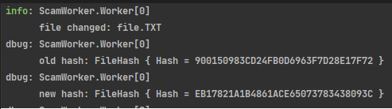

# Scam worker

Scam worker is a a background service
which observes changes of files in a specified directory.

## Configuration
Scam worker can be configured in `appsettings.Development.json` by specifying the root directory for observing files `ScanPath` and time to wait between each scan `WaitMs`.

```json
  "Worker": {
    "ScanPath":  "C://users//my-user//Music",
    "WaitMs": 5000
  }
```
## Example



